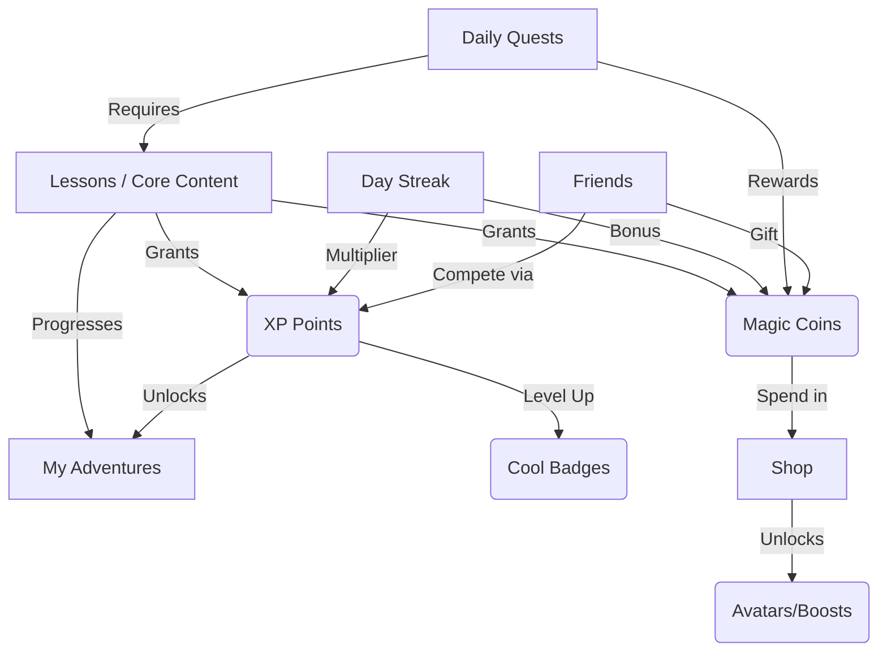

# App Flow & Gamification System Design

This document defines the complete app flow and core system relationships, moving a user from an empty state to long-term engagement.

## 1. System Relationships Map



## 2. Core Systems Definition

1. **XP Points (Progression)**: Earned strictly through learning. Determines the user's overall Level. Levels dictate leaderboard status and unlock advanced Adventures.
2. **Magic Coins (Economy)**: The soft currency. Earned by completing Lessons, fulfilling Daily Quests, and maintaining Day Streaks. Spent in the Shop.
3. **Cool Badges (Achievements)**: Milestone trackers (e.g., "7-Day Streak", "Completed Space Adventure", "Earned 1000 Coins"). Displayed on the user profile.
4. **Day Streak (Habit Builder)**: Tracks consecutive days of completing at least one Lesson. A high streak grants a Coin multiplier (+10% per day, capped at +50%).
5. **My Adventures (Journeys)**: Thematic groupings of Lessons (e.g., "Math Mountain"). Represented as interactive maps.
6. **Daily Quest (Engagement)**: 3 auto-generated tasks per day (e.g., "Complete 2 lessons", "Earn 50 XP"). Completing all 3 opens a bonus chest.
7. **Friends (Social)**: Users can add friends via code. Enables comparing XP on the Leaderboard and sending free daily "Coin Gifts".
8. **Lessons (Content)**: The atomic unit of the app. Theory followed by a quiz.
9. **Shop (Sink)**: Where Magic Coins are spent. Includes cosmetic Avatars, Profile Banners, and "Streak Freezes".

## 3. The User Journey

### Phase 1: Empty State & Onboarding (Day 1)
- **State**: Level 1, 0 XP, 0 Coins, 0 Streak. No Badges.
- **Triggers**: Dashboard is visually restricted. "Starter Adventure" is glowing and pulsating. "Welcome! Let's earn your first 50 Coins!"
- **Action**: User completes Lesson 1.
- **Feedback**: Celebration animation. +50 Coins, +10 XP. Streak = 1. "You completed your first step!"

### Phase 2: First Reward & Habit Forming (Days 2-7)
- **State**: Active. User sees the Daily Quests panel.
- **Triggers**: "You have a 1-day streak! Don't lose it! Do 1 lesson today to earn a 10% Coin Bonus."
- **Action**: User returns to maintain the streak. They complete a Daily Quest.
- **Feedback**: They earn enough Coins to visit the Shop and buy their first custom Avatar. They hit Level 2 and earn the "Novice Learner" Badge.

### Phase 3: Long-Term Engagement (Weeks 2+)
- **State**: Fully engaged returning user.
- **Triggers**: Leaderboard resets weekly. New Adventures unlock at Level 5.
- **Action**: User adds friends to compete. Buys "Streak Freezes" from the shop just in case. Grinds XP to beat a friend.
- **Feedback**: Deep emotional investment through Badges, social status, and cosmetic ownership.

## 4. UI Structure & Screen Breakdown

- **Dashboard (Hub)**:
  - Top Bar: Level/XP Bar, Coin Balance, Streak Flame icon.
  - Hero: Current Active Adventure (Resume button).
  - Sidebar/Bottom: Daily Quests checklist (1/3 completed).
- **Adventure Map**: Visual path of nodes (Lessons). Locked nodes are grayed out.
- **Lesson Screen**: Distraction-free. Progress bar at top.
- **Reward Screen (Post-Lesson)**: Full-screen modal. Shows XP filling up, Coins raining down, and Streak incrementing.
- **Shop**: Grid of items. Tabs: "Avatars", "Banners", "Boosts".
- **Profile/Social**: Displays Badges, Level, and Friend Leaderboard.

## 5. Example Data Schema (TypeScript)

```typescript
// User Profile State
interface UserProfile {
  id: string;
  level: number;
  xp: number;
  magicCoins: number;
  dayStreak: {
    current: number;
    highest: number;
    lastActiveDate: string;
    freezesAvailable: number; // bought from shop
  };
  badges: string[]; // Badge IDs
  friends: string[]; // User IDs
}

// Daily Quest Definition
interface DailyQuest {
  id: string;
  type: 'LESSONS_COMPLETED' | 'XP_EARNED' | 'PERFECT_QUIZ';
  targetValue: number;
  currentValue: number;
  rewardCoins: number;
  isCompleted: boolean;
}
```

## User Review Required
Does this conceptual design meet your requirements? Once approved, let me know if you would like to:
1. Implement this system documentation directly into the `paper.vue` Dev Documentation page.
2. Scaffold actual Pinia stores (`useUserStore`, `useGamificationStore`) and TypeScript types matching this schema in the codebase.
